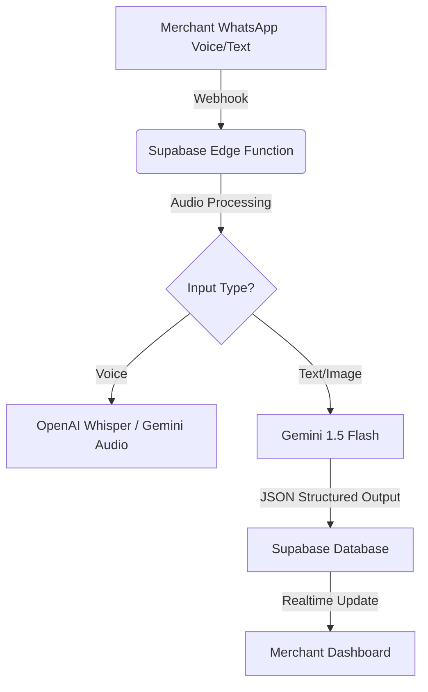

# 🧠 MRU Merchant OS: Google Gemini Integration Strategy

## 1. Executive Summary

This document outlines the robust integration of **Google Gemini Models (1.5 Flash & 1.5 Pro)** into the MRU Merchant OS ecosystem. By leveraging Gemini's long context window, high speed, and cost efficiency, we will power the platform's core AI features: **Voice-First Store Creation**, **Transaction Intent Parsing**, and **Multilingual Sales Assistance**.

### Why Gemini for MRU?
- **Speed & Cost (Gemini 1.5 Flash):** Ideal for high-volume, low-latency tasks like real-time transaction logging via WhatsApp voice notes.
- **Reasoning Capabilities (Gemini 1.5 Pro):** Perfect for complex tasks like generating entire storefront structures from simple merchant prompts.
- **Multimodal Native:** Seamlessly handles text, image (product photos), and potential future audio inputs directly.
- **Multilingual Excellence:** Superior performance in French and English, crucial for our West African target market.

---

## 2. Core Integration Architecture

The AI logic will be hosted primarily on **Supabase Edge Functions (Deno)** to ensure low latency and secure API key management.



---

## 3. Implementation: AI Agents & Prompts

We will implement three specialized AI agents using Gemini.

### 🤖 Agent A: The "Store Architect" (Storefront Generator)
**Role:** Generates a complete digital storefront structure from a simple merchant description.
**Model:** `gemini-1.5-pro` (high reasoning)
**Trigger:** Merchant registration or "Create Store" feature.

#### **System Instruction (Robust Prompt):**
> "You are an expert E-commerce Store Architect for West African markets.
> Your goal is to generate a structured JSON configuration for a digital storefront based on a merchant's unstructured description.
> 
> **Input:** 'I sell printed fabrics, wax prints from Holland, and some jewelry in Conakry.'
> 
> **Output Constraints:**
> 1.  Return ONLY valid JSON.
> 2.  Suggest a catchy, professional store name if none is provided.
> 3.  Categorize products logically (e.g., 'Textiles', 'Accessories').
> 4.  Generate SEO-friendly descriptions in both French and English.
> 5.  Suggest a color palette suitable for the brand vibe.
> 
> **JSON Schema:**
> {
>   'store_name': string,
>   'description_en': string,
>   'description_fr': string,
>   'categories': string[],
>   'theme_color': string (hex),
>   'suggested_products': [
>     { 'name': string, 'category': string, 'price_estimate': number }
>   ]
> }"

---

### 🤖 Agent B: The "Transaction Clerk" (Voice/Text Intent)
**Role:** Parses informal voice notes or text messages into structured transaction data.
**Model:** `gemini-1.5-flash` (low latency)
**Trigger:** WhatsApp incoming message webhook.

#### **System Instruction (Robust Prompt):**
> "You are a precise Transaction Recording Assistant.
> Your task is to extract transaction details from informal speech or text.
> 
> **Context:** The user is a merchant in Guinea/West Africa. Currency is likely GNF (Guinean Franc).
> 
> **Input:** 'Sold 3 yards of blue wax print for 150,000 and 2 bracelets for 50,000 to Madame Diallo.'
> 
> **Processing Rules:**
> 1.  Identify the Intent: `SALE`, `EXPENSE`, `RESTOCK`, or `UNKNOWN`.
> 2.  Extract Entities: Product Name, Quantity, Unit Price, Total Price, Customer Name.
> 3.  Calculate totals if missing.
> 
> **JSON Output Schema:**
> {
>   'intent': 'SALE',
>   'items': [
>     { 'product': 'blue wax print', 'qty': 3, 'unit': 'yards', 'price': 150000, 'currency': 'GNF' },
>     { 'product': 'bracelets', 'qty': 2, 'price': 50000, 'currency': 'GNF' }
>   ],
>   'customer': 'Madame Diallo',
>   'total_transaction_value': 250000
> }"

---

### 🤖 Agent C: The "Sales Assistant" (Customer Support)
**Role:** Answers customer queries about product availability and price based on database context.
**Model:** `gemini-1.5-flash`
**Trigger:** Customer chat on the storefront.

#### **System Instruction (Robust Prompt):**
> "You are a friendly, helpful Sales Assistant for [Store Name].
> You have access to the current inventory list provided in the context.
> 
> **Inventory Context:** {JSON list of available products}
> 
> **Rules:**
> 1.  Only recommend products currently in stock.
> 2.  If a user asks for something out of stock, suggest a similar available alternative.
> 3.  Keep responses concise and polite.
> 4.  Reply in the same language as the user (English or French).
> 
> **Input:** 'Do you have any red fabric?'
> **Output:** Natural language response based on inventory."

---

## 4. Technical Setup Guide

### Step 1: Obtain API Key
Get your key from [Google AI Studio](https://aistudio.google.com/).

### Step 2: Configure Environment
Add the following to your `.env.local` and Supabase secrets:
```bash
GOOGLE_AI_API_KEY=your_gemini_api_key_here
```

### Step 3: Integration Pattern (TypeScript / Deno)

We will use the generic REST API or the Node.js SDK (if compatible with Edge Runtime) to interface with Gemini.

**Example function: `supabase/functions/process-intent/index.ts`**

```typescript
import { createClient } from 'https://esm.sh/@supabase/supabase-js@2'

const GEMINI_API_KEY = Deno.env.get('GOOGLE_AI_API_KEY')
const GEMINI_URL = `https://generativelanguage.googleapis.com/v1beta/models/gemini-1.5-flash:generateContent?key=${GEMINI_API_KEY}`

Deno.serve(async (req) => {
  const { text_input } = await req.json()

  // Construct the prompt for the Transaction Clerk
  const systemPrompt = `You are a precise Transaction Recording Assistant... (Prompt B above)`;
  
  const payload = {
    contents: [
      {
        role: "user",
        parts: [{ text: systemPrompt + "\n\nInput: " + text_input }]
      }
    ],
    generationConfig: {
      responseMimeType: "application/json"
    }
  }

  const response = await fetch(GEMINI_URL, {
    method: 'POST',
    headers: { 'Content-Type': 'application/json' },
    body: JSON.stringify(payload)
  })

  const data = await response.json()
  const resultText = data.candidates[0].content.parts[0].text
  
  // Parse JSON and return
  return new Response(resultText, { headers: { 'Content-Type': 'application/json' } })
})
```

---

## 5. Verification & Testing Strategy

To ensure "robustness," we must validate AI outputs before writing to the database.

1.  **JSON Validation:** All Gemini outputs must be requested in `application/json` mode (supported by Gemini 1.5).
2.  **Schema Enforcement:** Use Zod in the Edge Function to parse and validate the AI's JSON response. If validation fails, trigger a retry or flag for manual review.
3.  **Latency Monitoring:** Track execution time. Flash should return within <2 seconds for text inputs.
4.  **Fallback Mechanism:** If the confidence score is low or parsing fails, return a "Clarification Request" to the user: *"I didn't quite catch that. Did you mean...?"*

---

## 6. Next Steps for Developer

1.  **Generate API Key:** Go to Google AI Studio.
2.  **Set Secrets:** Run `npx supabase secrets set GOOGLE_AI_API_KEY=...`
3.  **Deploy Functions:** Deploy the drafted Edge Functions.
4.  **Test:** Use the "Transaction Clerk" with sample fragmented voice transcripts.
